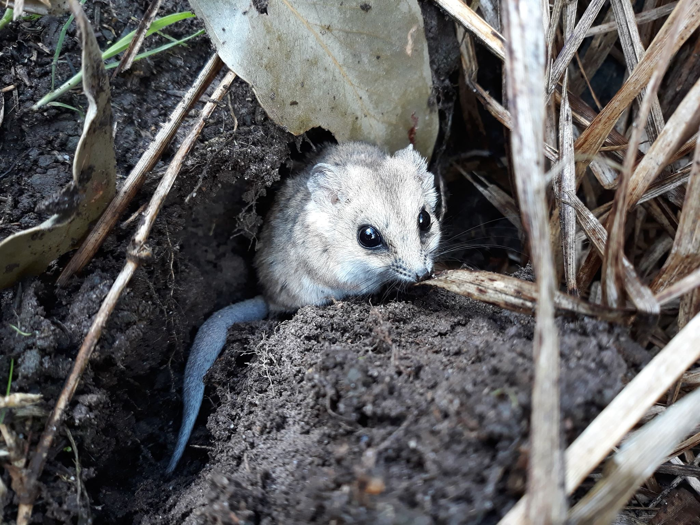

:::::::::::::::::::::::::::::::::::::: questions 

- Why is the fat‑tailed dunnart a useful model for microbiome studies?
- What are the expected experimental differences between captive and wild animals?
- Why use a byobu / screen session on a remote instance?
- What are symbolic links and why are they used here?

::::::::::::::::::::::::::::::::::::::::::::::::

::::::::::::::::::::::::::::::::::::: objectives

- Place the dataset in ecological and conservation context.
- Relate host ecology and sample provenance to interpretation of microbiome results.
- Launch and reconnect to a persistent byobu‑screen session.
- Create symbolic links to shared tutorial data to avoid redundant copies.

::::::::::::::::::::::::::::::::::::::::::::::::

## Background

What is the influence of captivity on gut microbiota of the fat-tailed dunnart?

### The Players

(Photo credit: Emily Scicluna)

* Fat-tailed dunnart [*Sminthopsis crassicaudata*](https://en.wikipedia.org/wiki/Fat-tailed_dunnart) - a species of mouse-like marsupial in the family Dasyuridae, which includes quolls, the Tasmanian devil, and the extinct Thylacine. There are 10 samples in this dataset (*This data is a subset from a larger experiment*); 5 faecal samples each from captive and wild fat-tailed dunnarts.  
   

### The Study
Indigenous microbial communities (microbiota) play critical roles in host health. Small marsupials, such as the fat-tailed dunnart, are increasingly used as model systems to understand how environmental conditions shape host-associated microbiomes. Transitions between wild and captive environments can substantially alter diet, behaviour, and microbial exposure, providing a natural framework to investigate microbiome restructuring and its potential consequences for host physiology and health. Here, we characterise the gut microbiome of wild and captive fat-tailed dunnarts to assess how captivity influences microbial community composition. This dataset represents a subset of a larger experimental framework examining microbiome-mediated effects on host function and conservation outcomes.

### QIIME 2 Analysis platform

::: caution

The version used in this workshop is `qiime2-2026.1`. Other versions of QIIME2 may result in minor differences in results.
    
:::    

Quantitative Insights Into Microbial Ecology 2 ([QIIME 2™](https://www.nature.com/articles/s41587-019-0209-9)) is a next-generation microbiome [bioinformatics platform](https://qiime2.org/) that is extensible, free, open source, and community developed. It allows researchers to:  

* Automatically track analyses with decentralised data provenance
* Interactively explore data with beautiful visualisations
* Easily share results without QIIME 2 installed
* Plugin-based system — researchers can add in tools as they wish

#### Viewing QIIME2 visualisations

::: callout

In order to use QIIME2 View to visualise your files, you will need to use a Google Chrome or Mozilla Firefox web browser (not in private browsing). For more information, click [here](https://view.qiime2.org).

:::

As this workshop is being run on a remote Nectar Instance, you will need to [download the visual files (*.qzv) to your local computer](https://mbite.mdhs.unimelb.edu.au/nectar-instances/transferring-files-between-your-computer-and-nectar-instance.html) and view them in [QIIME2 View](https://view.qiime2.org) (q2view).

::: callout

We will be doing this step multiple times throughout this workshop to view visualisation files as they are generated.

:::

 
Alternatively, ***if you have QIIME2 installed and are running it on your own computer***, you can use `qiime tools view` to view the results from the command line (e.g. `qiime tools view filename.qzv`). `qiime tools view` opens a browser window with your visualization loaded in it. When you are done, you can close the browser window and press `ctrl-c` on the keyboard to terminate the command.

::::::::::::::::::::::::::::::::::::: keypoints 

- Captivity can alter diet, exposure and behaviour — all of which may reshape the gut microbiome.
- The dataset contains a small, balanced subset (5 captive, 5 wild) suitable for teaching and demonstrating methods.
- Use byobu-screen to keep long‑running commands alive across disconnections.
- Symlinks point to /mnt/shared_data to conserve storage and keep everyone working from the same files.

::::::::::::::::::::::::::::::::::::::::::::::::

