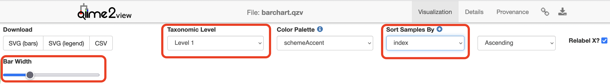
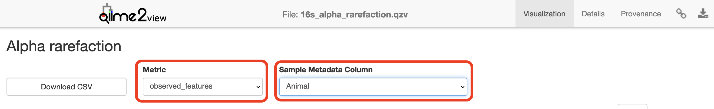
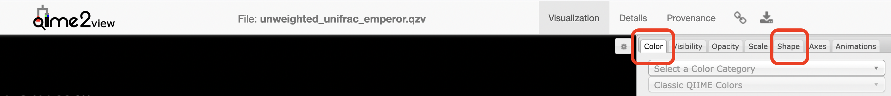
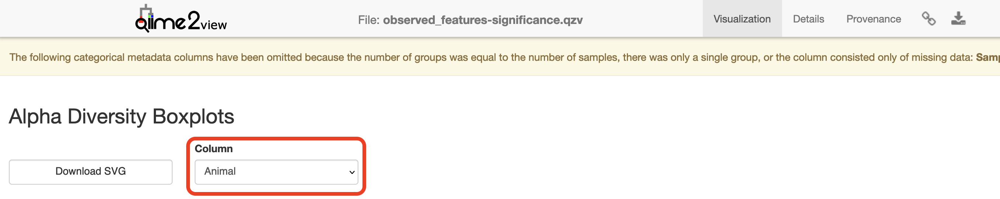
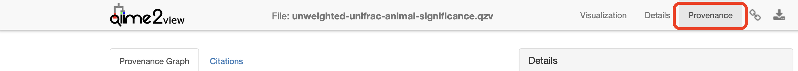

:::::::::::::::::::::::::::::::::::::: questions 

- How can relative abundance barplots aid in exploratory analysis?
- How do rarefaction and sampling depth choices influence diversity analyses?
- What statistical tests are appropriate for alpha and beta diversity comparisons here?


::::::::::::::::::::::::::::::::::::::::::::::::

::::::::::::::::::::::::::::::::::::: objectives

- Create interactive taxa barplots and rarefaction curves to assess composition and sequencing depth.
- Run core‑metrics‑phylogenetic (or equivalent) to compute alpha and beta metrics at a chosen sampling depth.
- Test for differences in alpha diversity (alpha‑group‑significance) and community composition (beta‑group‑significance / PERMANOVA), and perform differential abundance testing (ANCOM‑BC2).

::::::::::::::::::::::::::::::::::::::::::::::::


## Basic visualisations and statistics

### ASV relative abundance bar charts
Create bar charts to compare the relative abundance of ASVs across samples.


```bash
qiime taxa barplot \
--i-table analysis/taxonomy/16s_table_filtered.qza \
--i-taxonomy analysis/taxonomy/classification.qza \
--m-metadata-file dunnart_metadata.tsv \
--o-visualization analysis/visualisations/barchart.qzv \
--verbose
```

::::::::::::::::::::::::::::::::::::: challenge

## Visualisations: Taxonomy Barplots

Copy `analysis/visualisations/barchart.qzv` to your local computer and view in QIIME 2 View (q2view). Try selecting different taxonomic levels and metadata-based sample sorting.


:::::::::::::::: solution

[Click to view the **`barchart.qzv`** file in QIIME 2 View](https://view.qiime2.org/visualization/?src=https://www.dropbox.com/scl/fo/romu76hw5alep6qj4xfws/APrHWMBRZRFHT5GCxr_2NR0/barchart.qzv?rlkey=z0rtnozon2hlic4ba6i30c301).

Increase the "Bar Width", select "Captivity" in "Sort Samples By" drop-down menu and explore the resulting barplots by changing the levels in the "Change Taxonomic Level" dropdown menu (Select Level 1, then Level 3, and then Level 5 for example).  




:::::::::::::::::::::::::
:::::::::::::::::::::::::::::::::::::::::::::::


### Rarefaction curves
Generate rarefaction curves to determine whether the samples have been sequenced deeply enough to capture all the community members. The max depth setting will depend on the number of sequences in your samples.

::: discussion

#### Things to look for:

1. Do the curves for each sample plateau? If they don’t, the samples haven’t been sequenced deeply enough to capture the full diversity of the bacterial communities, which is shown on the y-axis.

2. At what sequencing depth (x-axis) do your curves plateau? This value will be important for downstream analyses, particularly for alpha diversity analyses.

:::


::: callout 

The value that you provide for --p-max-depth should be determined by reviewing the “Frequency per sample” information presented in the summary.qzv file that was created above after filtering. In general, choosing a value that is somewhere around the median frequency seems to work well, but you may want to increase that value if the lines in the resulting rarefaction plot don’t appear to be levelling out, or decrease that value if you seem to be losing many of your samples due to low total frequencies closer to the minimum sampling depth than the maximum sampling depth.

:::

```bash
qiime diversity alpha-rarefaction \
--i-table analysis/taxonomy/16s_table_filtered.qza \
--i-phylogeny analysis/tree/16s_rooted_tree.qza \
--p-max-depth 200000 \
--p-min-depth 500 \
--p-steps 40 \
--m-metadata-file dunnart_metadata.tsv \
--o-visualization analysis/visualisations/16s_alpha_rarefaction.qzv \
--verbose
```


::::::::::::::::::::::::::::::::::::: challenge

#### Visualisation: Rarefaction

Copy `analysis/visualisations/16s_alpha_rarefaction.qzv` to your local computer and view in QIIME 2 View (q2view).

:::::::::::::::: solution

[Click to view the **`16s_alpha_rarefaction.qzv`** file in QIIME 2 View](https://view.qiime2.org/visualization/?src=https://www.dropbox.com/scl/fo/romu76hw5alep6qj4xfws/APhv6-MkB307twQ0bCWkrkY/16s_alpha_rarefaction.qzv?rlkey=z0rtnozon2hlic4ba6i30c301).

Select "Animal" in the "Sample Metadata Column" and "observed_features" under "Metric":



:::::::::::::::::::::::::
:::::::::::::::::::::::::::::::::::::::::::::::


### Alpha and beta diversity analysis
The following is taken  from the [Moving Pictures tutorial](https://amplicon-docs.qiime2.org/en/stable/tutorials/moving-pictures.html) and adapted for this data set. QIIME 2’s diversity analyses are available through the `q2-diversity` plugin, which supports computing alpha- and beta- diversity metrics, applying related statistical tests, and generating interactive visualisations. We’ll first apply the core-metrics-phylogenetic method, which rarefies a FeatureTable[Frequency] to a user-specified depth, computes several alpha- and beta- diversity metrics, and generates principle coordinates analysis (PCoA) plots using Emperor for each of the beta diversity metrics.

The metrics computed by default are:

* Alpha diversity (operate on a single sample (i.e. within sample diversity)).
    * Shannon’s diversity index (a quantitative measure of community richness)
    * Observed OTUs (a qualitative measure of community richness)
    * Faith’s Phylogenetic Diversity (a qualitative measure of community richness that incorporates phylogenetic relationships between the features)
    * Evenness (or Pielou’s Evenness; a measure of community evenness)
* Beta diversity (operate on a pair of samples (i.e. between sample diversity)).
    * Jaccard distance (a qualitative measure of community dissimilarity)
    * Bray-Curtis distance (a quantitative measure of community dissimilarity)
    * unweighted UniFrac distance (a qualitative measure of community dissimilarity that incorporates phylogenetic relationships between the features)
    * weighted UniFrac distance (a quantitative measure of community dissimilarity that incorporates phylogenetic relationships between the features)

An important parameter that needs to be provided to this script is `--p-sampling-depth`, which is the even sampling (i.e. rarefaction) depth that was determined above. As most diversity metrics are sensitive to different sampling depths across different samples, this script will randomly subsample the counts from each sample to the value provided for this parameter. For example, if `--p-sampling-depth 500` is provided, this step will subsample the counts in each sample without replacement, so that each sample in the resulting table has a total count of 500. If the total count for any sample(s) are smaller than this value, those samples will be excluded from the diversity analysis. Choosing this value is tricky. We recommend making your choice by reviewing the information presented in the summary.qzv file that was created above. Choose a value that is as high as possible (so more sequences per sample are retained), while excluding as few samples as possible.


```bash
qiime diversity core-metrics-phylogenetic \
  --i-phylogeny analysis/tree/16s_rooted_tree.qza \
  --i-table analysis/taxonomy/16s_table_filtered.qza \
  --p-sampling-depth 100000 \
  --m-metadata-file dunnart_metadata.tsv \
  --output-dir analysis/diversity_metrics
```

Copy the `.qzv` files created from the above command into the `visualisations` subdirectory.

```bash
cp analysis/diversity_metrics/*.qzv analysis/visualisations
```

::::::::::::::::::::::::::::::::::::: challenge

#### Visualisations: Unweighted UniFrac Emperor Ordination

To view the differences between sample composition using unweighted UniFrac in ordination space, copy `analysis/visualisations/unweighted_unifrac_emperor.qzv` to your local computer and view in QIIME 2 View (q2view).

:::::::::::::::: solution

[Click to view the **`unweighted_unifrac_emperor.qzv`** file in QIIME 2 View](https://view.qiime2.org/visualization/?src=https://www.dropbox.com/scl/fo/romu76hw5alep6qj4xfws/ANRMHJr8pw58adbJ2yv4i38/unweighted_unifrac_emperor.qzv?rlkey=z0rtnozon2hlic4ba6i30c301).  


On q2view, select the "Color" tab, choose "Captivity" under the "Select a Color Category" dropdown menu.  



:::::::::::::::::::::::::
:::::::::::::::::::::::::::::::::::::::::::::::


Next, we’ll test for associations between categorical metadata columns and alpha diversity data. We’ll do that here for observed ASVs and evenness metrics.


```bash
qiime diversity alpha-group-significance \
  --i-alpha-diversity analysis/diversity_metrics/observed_features_vector.qza \
  --m-metadata-file dunnart_metadata.tsv \
  --o-visualization analysis/visualisations/observed_features-significance.qzv
```

::::::::::::::::::::::::::::::::::::: challenge

#### Visualisation: Observed Diversity output

Copy `analysis/visualisations/observed_features-significance.qzv` to your local computer and view in QIIME 2 View (q2view).

:::::::::::::::: solution

[Click to view the **`observed_features-significance.qzv`** file in QIIME 2 View](https://view.qiime2.org/visualization/?src=https://www.dropbox.com/scl/fo/romu76hw5alep6qj4xfws/AMje09kxzAz65VKNBORJoAI/observed_features-significance.qzv?rlkey=z0rtnozon2hlic4ba6i30c301).  

Select "Captivity" under the "Column" dropdown menu.  



:::::::::::::::::::::::::
:::::::::::::::::::::::::::::::::::::::::::::::


<br>
```bash
qiime diversity alpha-group-significance \
  --i-alpha-diversity analysis/diversity_metrics/evenness_vector.qza \
  --m-metadata-file dunnart_metadata.tsv \
  --o-visualization analysis/visualisations/evenness-group-significance.qzv
```

::::::::::::::::::::::::::::::::::::: challenge

#### Visualisation: Evenness output

Copy `analysis/visualisations/evenness-group-significance.qzv` to your local computer and view in QIIME 2 View (q2view).

:::::::::::::::: solution

[Click to view the **`evenness-group-significance.qzv`** file in QIIME 2 View](https://view.qiime2.org/visualization/?src=https://www.dropbox.com/scl/fo/romu76hw5alep6qj4xfws/ALNMCSgm30C2zhm7sHNSA5s/evenness-group-significance.qzv?rlkey=z0rtnozon2hlic4ba6i30c301).  

Select "Captivity" under the "Column" dropdown menu.


:::::::::::::::::::::::::
:::::::::::::::::::::::::::::::::::::::::::::::


Next, we’ll analyse sample composition in the context of categorical metadata using a permutational multivariate analysis of variance (PERMANOVA, first described in Anderson (2001)) test using the beta-group-significance command. The following commands will test whether distances between samples within a group are more similar to each other then they are to samples from the other groups. If you call this command with the `--p-pairwise` parameter, as we’ll do here, it will also perform pairwise tests that will allow you to determine which specific pairs of groups differ from one another, if any. This command can be slow to run, especially when passing `--p-pairwise`, since it is based on permutation tests. So, unlike the previous commands, we’ll run beta-group-significance on specific columns of metadata that we’re interested in exploring, rather than all metadata columns to which it is applicable. Here we’ll apply this to our unweighted UniFrac distances, using two sample metadata columns, as follows.


```bash
qiime diversity beta-group-significance \
  --i-distance-matrix analysis/diversity_metrics/unweighted_unifrac_distance_matrix.qza \
  --m-metadata-file dunnart_metadata.tsv \
  --m-metadata-column Captivity \
  --o-visualization analysis/visualisations/unweighted-unifrac-captivity-significance.qzv \
  --p-pairwise
```

::::::::::::::::::::::::::::::::::::: challenge

#### Visualisation: Captivity significance output and provenance

Copy `analysis/visualisations/unweighted-unifrac-captivity-significance.qzv` to your local computer and view in QIIME 2 View (q2view).

:::::::::::::::: solution

[Click to view the **`unweighted-unifrac-captivity-significance.qzv`** file in QIIME 2 View](https://view.qiime2.org/visualization/?src=https://www.dropbox.com/scl/fo/romu76hw5alep6qj4xfws/ALN4XydwBZnK-0qP0xoUmJg/unweighted-unifrac-captivity-significance.qzv?rlkey=z0rtnozon2hlic4ba6i30c301).



:::::::::::::::::::::::::
:::::::::::::::::::::::::::::::::::::::::::::::


Finally, we'll do differential abundance testing with ANCOM-BC2. ANCOM-BC2 is a compositionally-aware linear regression model that allows testing for differentially abundant features across sample groups while also implementing bias correction. This can be accessed using the ancombc2 action in the composition plugin.

We’ll apply ANCOM-BC2 to see which ASV are differentially abundant across Captivity. If you had more than two treatments, you can specify a reference level to define what each group is compared against (`--p-reference-levels 'Captivity::Wild'`). This is not necessary when you just have two groups. 

```bash
qiime composition ancombc2 \
  --i-table analysis/taxonomy/16s_table_filtered.qza \
  --m-metadata-file dunnart_metadata.tsv \
  --p-fixed-effects-formula Captivity \
  --o-ancombc2-output analysis/ancombc2-results.qza
```

```bash
qiime composition ancombc2-visualizer \
  --i-data analysis/ancombc2-results.qza \
  --i-taxonomy analysis/taxonomy/classification.qza \
  --o-visualization analysis/visualisations/ancombc2-barplot.qzv
```


::::::::::::::::::::::::::::::::::::: challenge

## Visualisation: Differential Abundance Testing

Copy `analysis/visualisations/ancombc2-barplot.qzv` to your local computer and view in QIIME 2 View (q2view).

:::::::::::::::: solution

[Click to view the **`ancombc2-barplot.qzv`** file in QIIME 2 View](https://view.qiime2.org/visualization/?src=https://www.dropbox.com/scl/fo/romu76hw5alep6qj4xfws/ALlpMHvkL69hNlowYAk5I7Y/ancombc2-barplot.qzv?rlkey=z0rtnozon2hlic4ba6i30c301).

:::::::::::::::::::::::::
:::::::::::::::::::::::::::::::::::::::::::::::


::::::::::::::::::::::::::::::::::::: keypoints 

- Explore taxonomic composition at multiple taxonomic levels and by metadata categories (e.g. Captivity).
- Choose sampling/depth parameters informed by the feature‑table summary and rarefaction curves to balance sample retention and depth.
- Unweighted and weighted UniFrac capture different aspects (presence/absence vs abundance) of community dissimilarity.
- ANCOM‑BC2 is compositionally aware and suitable for differential abundance while applying bias correction.

::::::::::::::::::::::::::::::::::::::::::::::::

